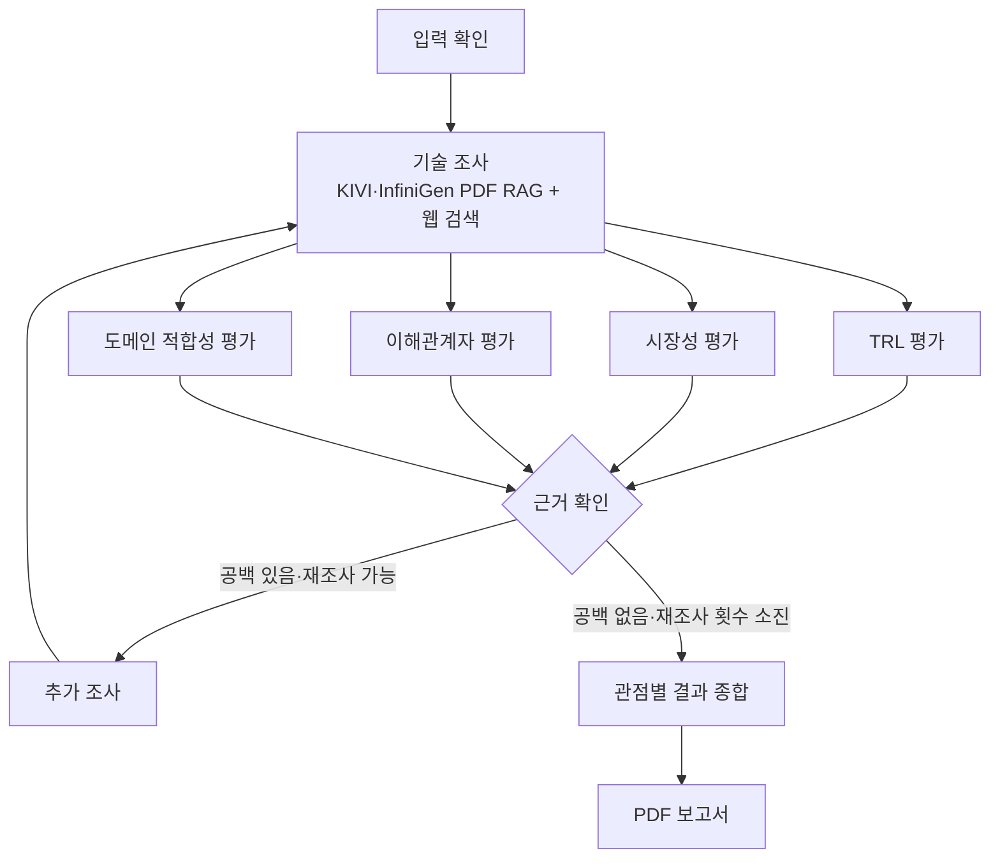

# KV Cache 최적화 기술 비교 평가 Agentic RAG

## Subject

본 프로젝트는 KV cache 최적화 기술인 **KIVI**와 **InfiniGen**을 선정하고, 공개 자료를 바탕으로 기술 성숙도·시장성·이해관계자·도메인 적합성을 비교 평가하는 Agentic RAG입니다. 기술의 우열을 단정하기보다 관점별 차이와 적용 조건, 근거의 한계를 정리합니다.

## Overview

- **Objective:** 두 기술을 복수 관점에서 비교 평가
- **Method:** LangGraph 기반 기술 조사, 병렬 평가, 근거 확인 및 제한된 재조사
- **Tools:** PDF RAG, FAISS, Tavily 웹 검색

`main.py`의 단일 `QUESTION`이 `graph.run(question)`으로 전달됩니다. Graph의 기술 조사 노드 하나가 KIVI·InfiniGen에 같은 `research_technology` 흐름을 적용한 뒤 네 평가 노드로 분기합니다.

## Selected Technologies

- **SW — KIVI:** KV cache 양자화로 GPU 메모리 사용량을 줄이는 접근
- **HW 메모리 활용 — InfiniGen:** KV 데이터를 CPU 호스트 메모리에 두고 필요한 데이터를 GPU로 가져오는 접근

InfiniGen은 새로운 하드웨어 자체보다 CPU·GPU 메모리 계층을 활용하는 기술로 분류했습니다.

## Features

- PDF 논문과 공개 웹 자료에서 기술 원리·성능·한계 근거 수집
- 기술 성숙도(TRL), 시장성, 이해관계자, 도메인 적합성 평가
- 근거 ID를 PDF 페이지 또는 웹 URL과 연결
- 근거가 부족하면 정해진 횟수 안에서 재조사
- **확증 편향 방지:** 확인된 출처·추론·미확인 정보를 구분하고, 상충 관계와 미해결 근거 공백을 보고서에 기록
- 평가 결과를 종합해 PDF 보고서 생성

## Tech Stack

- **Framework:** LangGraph, LangChain
- **LLM / Generator:** OpenAI 모델 (`LLM_MODEL` 환경변수로 지정)
- **LLM / Judge:** 검색 근거의 충분성 검토에 동일한 설정 모델 사용. 별도 Judge 모델은 지정하지 않음
- **Retrieval:** FAISS dense 벡터 검색
- **Embedding:** `BAAI/bge-m3`
- **Retrieval 평가:** InfiniGen 고정 질문 12개 기준 HitRate@5 **0.75(9/12)**, MRR@5 **0.576**

검색 지표는 관련 페이지를 찾는 성능이며, 생성된 평가의 사실 정확도를 의미하지 않습니다. KIVI 검색 평가는 아직 수행되지 않았습니다.

## Agents

- **Technical Research:** KIVI·InfiniGen의 PDF와 웹 자료 검색, 근거 추출
- **Maturity:** 공개 근거를 바탕으로 기술 성숙도 평가
- **Market:** 시장 규모·채택 현황·생태계 평가
- **Stakeholders:** 이해관계자별 영향 평가
- **Domain:** GPU 기반 클라우드 LLM 서비스 적용 조건 평가
- **Synthesis:** 관점별 차이와 상충 관계 종합
- **Report:** 평가 결과와 출처를 PDF 보고서로 작성

## Architecture



근거 구조 검사에서 공백이 남으면 제한 횟수만큼 같은 조사 노드를 다시 실행합니다. 횟수를 소진해도 미해결 항목을 종합에 전달하고 보고서의 6장에 남깁니다. 배경·비교 문헌의 자체 결과를 대상 기술의 직접 성숙도 근거로 취급하지 않습니다.

## Directory Structure

```text
├── data/                         # PDF 원문·로컬 인덱스·조사 결과
├── src/kv_cache_eval/
│   ├── common/                   # 공유 State·스키마·설정
│   ├── features/
│   │   ├── technical_research/   # PDF RAG·웹 조사
│   │   ├── maturity/             # TRL 평가
│   │   ├── market/               # 시장성 평가
│   │   ├── stakeholders/         # 이해관계자 평가
│   │   ├── domain/               # 도메인 적합성 평가
│   │   ├── synthesis/            # 평가 종합
│   │   └── report/               # PDF 보고서
│   └── graph/                    # 전체 워크플로와 근거 확인
├── scripts/                      # 기술별 조사·검색 평가 명령
├── tests/                        # 오프라인 테스트
├── main.py                       # 전체 그래프 실행
└── README.md
```

## Usage

Python 3.11과 `uv`가 필요합니다. `data/documents/`에 필요한 PDF를 준비하고, `.env`에 사용할 모델명과 API 키를 설정합니다.

```bash
uv sync --locked --all-extras
cp .env.example .env

# .env에 LLM_PROVIDER=openai, LLM_MODEL,
# OPENAI_API_KEY, TAVILY_API_KEY 설정
.venv/bin/python main.py
```

실행 질문은 `main.py`의 `QUESTION`에서 수정할 수 있습니다. `main.py`에는 별도의 JSON·PDF 작성 로직이 없고 PDF는 `report` 노드가 생성합니다. 실제 전체 실행에는 원문 PDF, 로컬 임베딩 모델, 설정한 OpenAI·Tavily 접근이 필요합니다. Ollama는 사용하지 않습니다.

| 설정 | 용도 |
| --- | --- |
| `LLM_PROVIDER=openai`, `LLM_MODEL`, `OPENAI_API_KEY` | 기술 조사와 평가·종합·보고서 생성 모델. 모델명은 저장소에서 고정하지 않음 |
| `EMBEDDING_MODEL` | 기본 `BAAI/bge-m3`를 로컬 dense 검색에 사용 |
| `TAVILY_API_KEY` | 공개 웹 조사와 시장성 검색 |
| `REPORT_PDF_PATH` | 최종 PDF 경로. 기본값은 `output/pdf/kv_cache_evaluation_report.pdf`이며 같은 경로는 덮어씀 |
| `REPORT_FONT_PATH` | 자동 탐색되는 한글 TTF가 없을 때 설치된 `.ttf` 파일 경로 |
| `LANGSMITH_TRACING` | 선택형 추적. `.env.example`의 기본값은 `false` |

`.env`는 이미 셸에 설정된 값을 덮어쓰지 않습니다. `uv sync --locked --all-extras`는 패키지만 설치하며 모델 가중치 다운로드나 외부 API 호출은 하지 않습니다. PDF에는 한글 TTF를 포함하므로 실행 환경에 해당 글꼴이 필요합니다.

## 검증 범위와 한계

오프라인 테스트는 외부 검색·LLM 응답을 fixture로 대체하고 Graph 배선, 네 평가, 재조사 상한, 종합, 인용 검사 및 PDF 생성을 확인합니다. 설치된 한글 TTF와 전체 extra가 준비된 환경에서 소켓 연결을 막고 실행할 수 있습니다.

```bash
env -u OPENAI_API_KEY -u TAVILY_API_KEY PYTHONPATH=tests/offline_guard:src HF_HUB_OFFLINE=1 LANGSMITH_TRACING=false .venv/bin/python -m unittest discover -s tests -v
```

`source_checked`는 발췌와 PDF 페이지 또는 웹 URL의 연결을 뜻하며 주장 전체의 의미·실제 운영 성과를 확정하지 않습니다. 종합과 보고서는 존재하지 않는 근거 ID를 거부하고, 최종 본문에서 실제 사용한 ID만 `REFERENCE`에 적습니다. 이해관계자 평가는 별도 검색 없이 공통 조사 근거를 재사용하므로 직접 반응·근거 기반 추론·미확인을 구분합니다.

실제 재조사 State에서 32,000바이트는 도메인 근거·메모와 검토 여유분을 담지 못해 기본 요청 한도를 **131,072바이트(128 KiB)**로 조정했습니다. 시장성 Tavily 검색은 중복 질의를 재사용하고 호출 간 최소 1초를 두며, 429에만 최대 3회 시도합니다. 429가 계속되면 같은 실행의 이전 시장 평가를 실패 메모와 함께 재사용하고, 이전 결과가 없으면 6개 항목을 `unverified`로 둡니다. 자세한 동작은 [`domain/README.md`](src/kv_cache_eval/features/domain/README.md)와 [`market/README.md`](src/kv_cache_eval/features/market/README.md)를 참조하세요.

실제 `main.py` 전체 실행의 완료 여부와 결과의 주장·인용 정확성은 아직 확인 중입니다. PDF 원문·인덱스·캐시·`.env`는 Git에 포함하지 않습니다.

## Contributors

- **배민혁** (`bmh7190`) : InfiniGen 기술 조사 RAG·웹 검색, 공통 조사 흐름 및 전체 그래프 통합
- **조수연** : KIVI RAG·근거 추출, 기술 성숙도(TRL) 평가
- **정태호** : 시장성 웹 조사, 평가 기준 및 시장성 평가 노드
- **김예진** : 이해관계자 평가 노드
- **안민아** : 도메인 적합성 평가와 수치 근거 검증
- **김지환** : 관점별 결과 종합 및 PDF 보고서 생성
