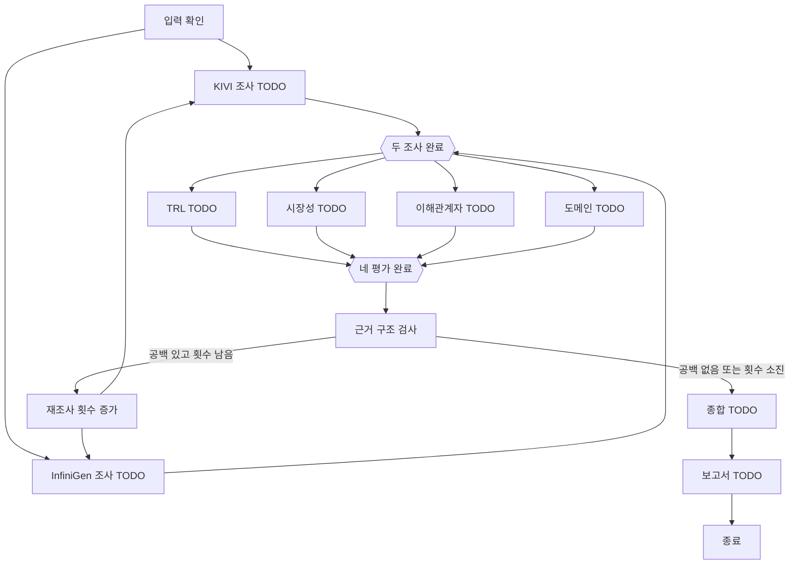

# KV Cache 최적화 기술 평가: 팀 협업 시작 구조

GPU 기반 클라우드 LLM 서비스에 KIVI(KV Cache 양자화)와 InfiniGen(CPU Host Memory에 KV를 두고 필요한 데이터를 GPU로 가져오는 접근)을 적용할 때의 근거와 조건을 비교하는 LangGraph 구조입니다. 기술은 사람이 선정했습니다. 알고리즘 구현이나 GPU 벤치마크가 아니라 공개 자료에 기반한 기술 평가가 목적입니다. 단일 승자보다 관점별 차이, 상충 관계, 적용 조건을 보고합니다.

## 현재 상태

- **구현됨:** 공유 State·자료형·초기값, 구조적 근거 공백 검사, 재조사 횟수 라우팅, 병렬 조사/평가 합류 그래프, 오프라인 smoke test.
- **TODO:** 원문 수집·RAG·출처 검증, 네 평가 노드, 내용 타당성 검사, 종합, 보고서 및 PDF 생성. 기본 기능 노드는 `NotImplementedError`로 중단됩니다. 테스트 대체 노드의 빈 데이터와 문구는 연구 결과가 아닙니다.
- LLM 제공자와 모델은 아직 선정하지 않았습니다. 임베딩 후보 `intfloat/multilingual-e5-small`도 검색 품질 검증 전이며 다운로드하거나 실행하지 않습니다.

## 설치와 실행

Python **3.11**을 사용합니다(`.python-version`, `pyproject.toml`). 현재 잠금 파일과 프로젝트 가상환경 설치는 macOS ARM64의 Python 3.11.15에서 검증했습니다. `uv`가 없으면 [공식 설치 안내](https://docs.astral.sh/uv/getting-started/installation/)를 따라 설치하세요. Python 3.11이 없으면 `uv python install 3.11`로 준비할 수 있습니다([공식 Python 안내](https://docs.astral.sh/uv/concepts/python-versions/)).

```bash
# 현재 공통 State/Graph 작업에 필요한 기본 설치
uv sync --locked

# 팀 전체 개발 도구를 한 번에 설치: RAG, 웹 검색, 보고서, 선택형 LLM 연동
uv sync --locked --all-extras

# 오프라인 smoke test 및 그래프 컴파일 확인
uv run --locked python -m unittest discover -s tests -v
uv run --locked python -c 'from kv_cache_eval.graph import build_graph; print(build_graph())'
```

`pyproject.toml`이 직접 의존성의 단일 기준이고 `uv.lock`이 해결된 버전을 고정합니다. `--locked`는 두 파일이 맞지 않으면 설치를 중단합니다([uv 공식 문서](https://docs.astral.sh/uv/concepts/projects/sync/)). 필요한 기능만 설치하려면 `uv sync --locked --extra rag`처럼 선택할 수 있습니다.

| 설치 범위 | 패키지와 용도 |
| --- | --- |
| 기본 | `langgraph`: 현재 구현된 StateGraph 배선과 테스트에 실제 사용 |
| `rag` | `langchain`, `langchain-community`, `langchain-text-splitters`, `langchain-huggingface`, `sentence-transformers`, `faiss-cpu`, `pypdf`, `pdfplumber`: 후속 PDF 로딩·분할·오픈소스 임베딩·로컬 검색용 |
| `web` | `langchain-tavily`: 후속 웹 검색용 |
| `report` | `reportlab`: 후속 PDF 생성용 |
| `llm-openai`, `llm-ollama` | 실습과 유사한 LLM 연결을 선택할 때 사용할 클라이언트. 제공자나 모델의 기본값을 정하지 않음 |

전체 옵션 설치는 패키지만 준비합니다. 모델 가중치 다운로드, 유료 API 호출, 문서 인덱싱은 수행하지 않습니다. 그래프 **컴파일**은 가능하지만 기본 노드로 호출하면 첫 조사 노드에서 의도적으로 중단됩니다. `.env.example`의 빈 `LLM_PROVIDER`, `LLM_MODEL`은 후속 구현 시 결정합니다. smoke test는 키·원문·네트워크가 필요 없습니다.

## 그래프

실선은 현재 배선 및 구조적 검사입니다. `TODO` 표시 노드는 함수 틀만 있습니다. 근거 부족 시 최대 `max_research_rounds`번 추가 조사하고 네 평가를 다시 실행합니다. 횟수를 소진하면 `evidence_gaps`를 유지한 채 종합 노드로 전달합니다. 종합 담당자는 미해결 항목을 명시해야 합니다.



`check_evidence`는 결과 누락, 미확인 출처, 근거 ID 연결을 확인하는 **최소 구조 검사**입니다. 문서의 실제 신뢰성, 실험 조건의 비교 가능성, 주장 내용의 타당성 판정은 조사/평가 담당자가 추가해야 합니다. 빈 근거나 빈 평가는 통과하지 않습니다.

## State와 노드 규약

`State`는 전체 실행의 공유 데이터입니다. `new_state()`에서 입력과 미생성 결과를 초기화합니다. 결과 `None`은 미생성, `evidence_gaps=None`은 미검토, `evidence_gaps=[]`는 검토 후 공백 없음입니다. `score=None`은 미판단이며 0점과 다릅니다. 노드는 `node(state) -> StateUpdate` 함수로 만들고 **자신이 생산하는 top-level 키만 반환**합니다. 병렬 노드가 전체 State를 돌려주면 충돌합니다. 누적 공유 키와 reducer는 현재 필요하지 않습니다.

| State 키 | 생산자 | 주 소비자 |
| --- | --- | --- |
| `selected_technologies`, `domain_and_criteria`, `max_research_rounds` | `new_state`/입력 | 모든 조사·평가, 입력 확인·라우팅 |
| `kivi_evidence` | KIVI 조사 | 네 평가, 근거 확인, 보고서 |
| `infinigen_evidence` | InfiniGen 조사 | 네 평가, 근거 확인, 보고서 |
| `maturity_eval` | TRL 평가 | 근거 확인, 종합 |
| `market_eval` | 시장성 평가 | 근거 확인, 종합 |
| `stakeholder_eval` | 이해관계자 평가 | 근거 확인, 종합 |
| `domain_eval` | 도메인 평가 | 근거 확인, 종합 |
| `evidence_gaps` | 근거 확인 | 재조사, 종합, 보고서 |
| `research_round` | 초기값/재조사 횟수 노드 | 재조사 라우팅 |
| `synthesis` | 종합 | 보고서 |
| `report` | 보고서 | 최종 출력 |

근거는 ID, 기술, 주장/발췌, 문서·URL·페이지, 모델·워크로드·비교 기준, 한계, 출처 확인 상태를 담습니다. 평가는 기술·기준·판단·nullable 점수·이유·근거 ID·불확실성·근거 상태를 연결합니다. TRL은 공개 정보에 근거한 추정이며 미공개 정보가 낮은 TRL을 뜻하지 않습니다. 이해관계자 항목은 직접 확인한 반응(`source_checked`)과 근거 기반 추론(`inferred`), 미확인(`unverified`)을 구별합니다. `public_estimate`는 공개 자료 기반 TRL 추정에 사용합니다. PDF 전문, 모델·벡터 DB 객체, 비밀정보는 State에 넣지 않습니다.

## 기능별 시작 파일

| 담당 기능 | 시작 파일 |
| --- | --- |
| 공통 계약·초기값 | `src/kv_cache_eval/common/schemas.py`, `state.py` |
| 기술 조사·RAG | `src/kv_cache_eval/features/technical_research/node.py`, `rag.py` |
| TRL | `src/kv_cache_eval/features/maturity/node.py` |
| 시장성 | `src/kv_cache_eval/features/market/node.py` |
| 이해관계자 | `src/kv_cache_eval/features/stakeholders/node.py` |
| 도메인 | `src/kv_cache_eval/features/domain/node.py` |
| 종합 | `src/kv_cache_eval/features/synthesis/node.py` |
| 보고서 | `src/kv_cache_eval/features/report/node.py` |
| 배선·재조사 | `src/kv_cache_eval/graph/workflow.py`, `gates.py` |

기술 조사는 재사용 함수 `research_technology(state, technology)`를 구현하고 KIVI/InfiniGen 결과를 각각 별도 키에 반환합니다. 고른 RAG 원문 총합은 **200페이지 이하**로 관리합니다. 200페이지는 채울 목표나 보고서 분량이 아닙니다. `rag.py`에 E5의 `query:`/`passage:` 전처리와 token 기준 분할, 출처·페이지 추적을 구현합니다. 원문은 `data/documents/`에 로컬로 두고 저장소에는 포함하지 않습니다. 인덱스·캐시·`.env`·PDF도 저장하지 않습니다.

보고서는 **SUMMARY**로 시작해 **REFERENCE**로 끝나며 실제 사용한 근거만 인용해야 합니다. PDF 출력은 후속 기능입니다.

## 실습 참고

읽기 전용 참고 경로: `/Users/bmh7190/skala/skala-rag/langgraph/`의 `00-Basic/02-State.ipynb`, `00-Basic/03-Graph.ipynb`, `01-Features/21-Branching.ipynb`, `10-Agent/11-Multi-ReportAgent.ipynb`, `20-RAG/13-AgenticRAG.ipynb`와 `20-RAG/rag/{base,pdf,utils}.py`. 이 프로젝트는 실습의 함수형 `TypedDict`/`StateGraph` 패턴만 가져오며, 실습 노트북·출력·프롬프트·API 키를 복사하지 않습니다. 실습의 큰 1.x 의존성 목록 대신 현재 뼈대에 필요한 `langgraph`만 필수로 선언하고 후속 개발 패키지는 옵션으로 분리했습니다.
