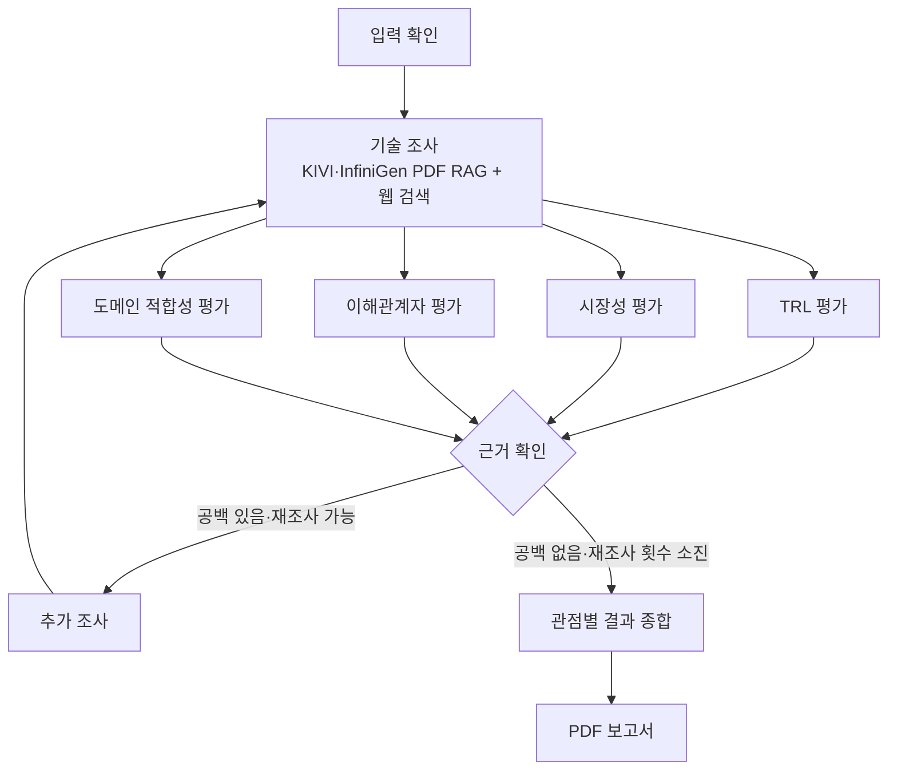

# KV Cache 최적화 기술 비교 평가 Agentic RAG

## Subject

본 프로젝트는 KV cache 최적화 기술인 **KIVI**와 **InfiniGen**을 선정하고, 공개 자료를 바탕으로 기술 성숙도·시장성·이해관계자·도메인 적합성을 비교 평가하는 Agentic RAG입니다. 기술의 우열을 단정하기보다 관점별 차이와 적용 조건, 근거의 한계를 정리합니다.

## Overview

- **Objective:** 두 기술을 복수 관점에서 비교 평가
- **Method:** LangGraph 기반 기술 조사, 병렬 평가, 근거 확인 및 제한된 재조사
- **Tools:** PDF RAG, FAISS, Tavily 웹 검색

## Selected Technologies

- **SW — KIVI:** KV cache 양자화로 GPU 메모리 사용량을 줄이는 접근
- **HW 메모리 활용 — InfiniGen:** KV 데이터를 CPU 호스트 메모리에 두고 필요한 데이터를 GPU로 가져오는 접근

InfiniGen은 새로운 하드웨어 자체보다 CPU·GPU 메모리 계층을 활용하는 기술로 분류했습니다.

## Features

- PDF 논문과 공개 웹 자료에서 기술 원리·성능·한계 근거 수집
- 기술 성숙도(TRL), 시장성, 이해관계자, 도메인 적합성 평가
- 근거 ID를 PDF 페이지 또는 웹 URL과 연결
- 근거가 부족하면 정해진 횟수 안에서 재조사
- **확증 편향 방지:** 확인된 출처·추론·미확인 정보를 구분하고, 상충 관계와 미해결 근거 공백을 보고서에 기록
- 평가 결과를 종합해 PDF 보고서 생성

## Tech Stack

- **Framework:** LangGraph, LangChain
- **LLM / Generator:** OpenAI 모델 (`LLM_MODEL` 환경변수로 지정)
- **LLM / Judge:** 검색 근거의 충분성 검토에 동일한 설정 모델 사용. 별도 Judge 모델은 지정하지 않음
- **Retrieval:** FAISS dense 벡터 검색
- **Embedding:** `BAAI/bge-m3`
- **Retrieval 평가:** InfiniGen 고정 질문 12개 기준 HitRate@5 **0.75(9/12)**, MRR@5 **0.576**

검색 지표는 관련 페이지를 찾는 성능이며, 생성된 평가의 사실 정확도를 의미하지 않습니다. KIVI 검색 평가는 아직 수행되지 않았습니다.

## Agents

- **Technical Research:** KIVI·InfiniGen의 PDF와 웹 자료 검색, 근거 추출
- **Maturity:** 공개 근거를 바탕으로 기술 성숙도 평가
- **Market:** 시장 규모·채택 현황·생태계 평가
- **Stakeholders:** 이해관계자별 영향 평가
- **Domain:** GPU 기반 클라우드 LLM 서비스 적용 조건 평가
- **Synthesis:** 관점별 차이와 상충 관계 종합
- **Report:** 평가 결과와 출처를 PDF 보고서로 작성

## Architecture



## Directory Structure

```text
├── data/                         # PDF 원문·로컬 인덱스·조사 결과
├── src/kv_cache_eval/
│   ├── common/                   # 공유 State·스키마·설정
│   ├── features/
│   │   ├── technical_research/   # PDF RAG·웹 조사
│   │   ├── maturity/             # TRL 평가
│   │   ├── market/               # 시장성 평가
│   │   ├── stakeholders/         # 이해관계자 평가
│   │   ├── domain/               # 도메인 적합성 평가
│   │   ├── synthesis/            # 평가 종합
│   │   └── report/               # PDF 보고서
│   └── graph/                    # 전체 워크플로와 근거 확인
├── scripts/                      # 기술별 조사·검색 평가 명령
├── tests/                        # 오프라인 테스트
├── main.py                       # 전체 그래프 실행
└── README.md
```

## Usage

Python 3.11과 `uv`가 필요합니다. `data/documents/`에 필요한 PDF를 준비하고, `.env`에 사용할 모델명과 API 키를 설정합니다.

```bash
uv sync --locked --all-extras
cp .env.example .env

# .env에 LLM_PROVIDER=openai, LLM_MODEL,
# OPENAI_API_KEY, TAVILY_API_KEY 설정
.venv/bin/python main.py
```

실행 질문은 `main.py`의 `QUESTION`에서 수정할 수 있습니다. 기본 PDF 출력 경로는 `output/pdf/kv_cache_evaluation_report.pdf`입니다.

## Contributors

- **배민혁** : InfiniGen 기술 조사 RAG·웹 검색, 공통 조사 흐름 및 전체 그래프 통합
- **조수연** : KIVI RAG·근거 추출, 기술 성숙도(TRL) 평가
- **정태호** : 시장성 웹 조사, 평가 기준 및 시장성 평가 노드
- **김예진** : 이해관계자 평가 노드
- **안민아** : 도메인 적합성 평가와 수치 근거 검증
- **김지환** : 관점별 결과 종합 및 PDF 보고서 생성
