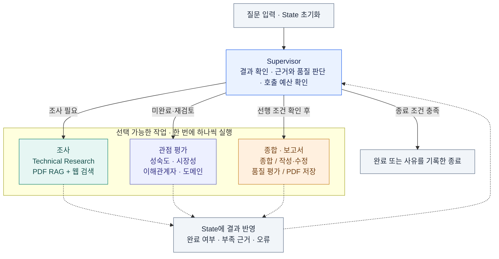

# KV Cache 최적화 기술 비교 평가 Agentic RAG

## Subject

**KIVI와 InfiniGen을 조사하고, 기술 성숙도·시장성·이해관계자·도메인 적합성을 비교하는 Supervisor 기반 멀티 에이전트 프로젝트입니다.**

GPU 기반 클라우드 LLM 서비스를 적용 도메인으로 삼아, 공개 자료의 근거와 실험 조건·한계를 담은 PDF 보고서를 생성합니다.

## Overview

- **Objective:** 두 기술을 동일한 네 관점으로 평가하고 적용 조건과 차이를 정리합니다.
- **Pattern:** Supervisor. 작업 결과에 따라 재조사와 보고서 수정을 구분해 배정하기 위해 선택했습니다.
- **동적 처리:** 미완료 관점·근거 부족·품질 지적을 보고 다음 작업과 범위를 결정합니다. 모든 작업자는 Supervisor로 복귀합니다.

예를 들어 InfiniGen의 처리량 근거가 부족하면 해당 범위를 다시 조사하고 관련 평가를 갱신합니다. 보고서만 품질 미달이면 기존 근거로 보고서를 수정합니다. Supervisor의 배정·종료 판단은 규칙 기반 코드입니다.

## Selected Technologies

| 구분 | 기술 | 접근과 선정 이유 |
|---|---|---|
| SW | **KIVI** | 비대칭 2bit KV cache 양자화. 메모리 절감·처리량과 모델 품질 사이의 관계 평가 |
| HW 메모리 활용 | **InfiniGen** | CPU의 KV cache를 선별해 GPU로 미리 적재. 전송 병목·지연시간·운영 복잡성 평가 |

InfiniGen은 CPU·GPU 메모리 계층을 활용하는 시스템 기술로 분류했습니다. 두 논문의 실험 조건이 달라 성능 배율만으로 우열을 정하지 않습니다.

## Features

### 조사와 평가

- **근거 수집:** PDF 5개·총 140쪽을 대상으로 RAG 검색하고, 공개 구현·시장 정보는 Tavily로 조사합니다.
- **출처 추적:** 주장마다 근거 ID·발췌·PDF 페이지 또는 URL을 연결합니다.
- **부분 재작업:** 기술·항목·보완 이유를 지정해 재조사하고 기존 평가와 병합합니다.
- **실행 복구:** SQLite 체크포인트에 결과를 저장하고 같은 실행 ID로 중단 지점에서 재개합니다.

### 확증 편향 방지

원논문·독립 평가·배경 자료의 역할을 구분하고 다른 기술의 성과를 평가 대상에 옮기지 않습니다. 유리한 결과뿐 아니라 반대 근거와 제약을 함께 기록하며, 자료가 부족한 항목은 판단·점수를 보류합니다. 출처가 연결된 사실과 보고서의 추론도 구분합니다.

### 보고서 품질 평가

목차·본문 누락과 인용 ID를 먼저 검사한 뒤, LLM Judge가 아래 기준을 `pass / fail / unknown`으로 판정합니다.

| 기준 | 확인 내용 |
|---|---|
| 근거 충실성 | 주요 사실과 수치가 인용한 원문으로 뒷받침되는가 |
| 중립성 | 조건 없는 추천이나 서로 다른 실험의 직접 순위화가 없는가 |
| 편향 통제 | 반대 근거·한계·특정 출처에 대한 의존성을 다루는가 |
| 관점 커버리지 | 두 기술의 네 관점에 판단·이유·조건·한계가 있는가 |

최신 보고서가 네 기준을 모두 통과해야 PDF를 저장합니다. 미달 시 수정 이유를 전달해 **추가 작성은 기본 1회**, 초안 포함 최대 2회로 제한합니다. 형식·인용 오류와 품질 미달은 같은 재작성 예산을 사용합니다.

PDF는 실제 본문 인용으로 참고문헌을 만들고 같은 인용 묶음의 중복 번호를 정리합니다. 임시 파일에서 참고문헌 포함 **10쪽 이하**인지 확인한 뒤 최종 파일을 교체합니다.

## Tech Stack

| 구분 | 사용 기술 |
|---|---|
| Runtime / Framework | Python 3.11, uv / LangGraph, LangChain |
| LLM / Generator | OpenAI `gpt-5.4-mini` — 확인한 실행 설정, `LLM_MODEL`로 지정 |
| LLM / Judge | `JUDGE_MODEL` 지정 가능, 생략하면 Generator와 같은 모델 사용 |
| Retrieval / Embedding | FAISS dense 검색 / `BAAI/bge-m3` |
| Web / PDF | Tavily / PyPDFLoader, ReportLab, pypdf |
| 실행 저장 / 추적 | SQLite 체크포인트 / 로컬 JSONL, 선택적으로 LangSmith |

**검색 평가:** InfiniGen 고정 질문 12개에서 HitRate@5 **0.75**, MRR@5 **0.576**을 기록했습니다(2026-09-22, 문서·물리 페이지 일치 기준). KIVI 검색 성능이나 보고서 사실 정확도를 나타내는 지표는 아닙니다.

## Agents

| 노드 | 역할 |
|---|---|
| Supervisor | 결과·근거 부족·호출 예산을 확인해 다음 작업 또는 종료 결정 |
| Technical Research | 두 기술의 PDF RAG·웹 조사와 근거 추출 |
| Maturity | 공개 근거의 검증 수준으로 TRL 추정 |
| Market | 시장 규모·채택·생태계 조사 및 평가 |
| Stakeholders | 운영자·개발자·사용자·경쟁 기술·투자 및 산업 관점 평가 |
| Domain | 메모리·전송량·지연·처리량·품질·운영 난이도 평가 |
| Synthesis | 관점별 차이·상충 관계·적용 조건 종합 |
| Report / Quality | 근거를 인용한 보고서 작성·수정 / 구조·내용 검사 |
| Export PDF | 최신 품질 판정 확인, 인용 번호 정리, PDF 저장 |

## State Schema

[State 정의](src/kv_cache_eval/common/state.py)는 입력·작업 결과와 Supervisor 제어 정보를 구분합니다. 각 작업자는 자신이 맡은 결과 필드만 반환하며, 공통 `worker()`가 요청 범위와 반환값을 검증합니다.

| 설계 항목 | 적용 방식 |
|---|---|
| 제어 vs 페이로드 | `next_agent`·`retry_request`·호출 횟수·상태와 근거·평가·보고서 필드 분리 |
| 관측성 위치 | State에는 최신 결과·이유, JSONL에는 배정 이력, LangSmith에는 선택적 호출 추적 |
| 지속성 비용 | 전체 PDF·인덱스는 파일로, 추출 근거·결과는 State와 체크포인트로 관리 |
| 상관관계 | `trace_id`로 체크포인트와 실행 기록 연결 |
| 재개·복구 | 같은 실행 ID로 SQLite 체크포인트에서 재개 |
| 동시 처리 | 한 번에 작업자 하나를 실행해 State 동시 쓰기 방지 |
| 종료 보장 | 기본 배정 총 30회·노드별 6회·보고서 추가 작성 1회 |

`completed`는 최신 품질 통과와 PDF 저장 완료, `incomplete`는 근거·품질 부족 또는 작업 예산 소진, `failed`는 복구 불가 오류나 오류 재시도 소진을 뜻합니다. 배정 횟수는 내부 LLM 호출 수와 다릅니다.

## Architecture


```mermaid
flowchart TB
    INPUT["질문 입력 · State 초기화"] --> SUPERVISOR
    SUPERVISOR["Supervisor<br/>결과 확인 · 근거와 품질 판단 · 호출 예산 확인"]
    SUPERVISOR -->|종료 조건 충족| END_STATE["완료 또는 사유를 기록한 종료"]

    subgraph WORKERS["선택 가능한 작업 · 한 번에 하나씩 실행"]
        direction LR
        RESEARCH["조사<br/>Technical Research<br/>PDF RAG + 웹 검색"]
        EVALUATION["관점 평가<br/>성숙도 · 시장성<br/>이해관계자 · 도메인"]
        REPORT["종합 · 보고서<br/>종합 / 작성·수정<br/>품질 평가 / PDF 저장"]
    end

    SUPERVISOR -->|조사 필요| RESEARCH
    SUPERVISOR -->|미완료·재검토| EVALUATION
    SUPERVISOR -->|선행 조건 확인 후| REPORT

    RESEARCH -.-> RESULT
    EVALUATION -.-> RESULT
    REPORT -.-> RESULT
    RESULT["State에 결과 반영<br/>완료 여부 · 부족 근거 · 오류"] -.-> SUPERVISOR

    classDef control fill:#eaf2ff,stroke:#2563eb,color:#172554
    classDef research fill:#e6f6f3,stroke:#168570,color:#134e4a
    classDef evaluation fill:#edf0ff,stroke:#6366b8,color:#312e81
    classDef report fill:#fff0df,stroke:#c88427,color:#713f12
    classDef state fill:#f1f5f9,stroke:#64748b,color:#1e293b
    class SUPERVISOR control
    class RESEARCH research
    class EVALUATION evaluation
    class REPORT report
    class INPUT,RESULT,END_STATE state
```

**실선은 작업 배정·종료, 점선은 결과 복귀입니다.** 세 영역은 기능을 묶어 표시한 것이며 Supervisor가 그 안의 작업자 하나를 선택합니다. 종합·보고서·품질·PDF도 각각 실행 후 Supervisor로 돌아옵니다.

| 결과를 확인한 시점 | 다음 행동 |
|---|---|
| 아직 평가하지 않은 관점이 있음 | 해당 평가 배정 |
| 기술·관점의 근거가 부족함 | 범위를 지정해 재조사·재평가. 같은 기술·관점의 보완 검색은 최대 1회 |
| 기술 근거가 변경됨 | 관련 평가와 이후 보고서를 재검토. 유효한 시장성 결과는 재사용 |
| 보고서 품질이 미달함 | 기존 근거와 품질 지적으로 보고서 재작성 |
| 최신 품질 통과·PDF 저장 완료 | `completed`로 종료 |

종합과 보고서는 근거 충분성을 확인한 뒤 진행합니다. 필수 근거가 계속 부족하거나 호출 예산을 소진하면 사유를 남기고 종료합니다.

## Directory Structure

```text
├── main.py                       # 전체 실행
├── src/kv_cache_eval/
│   ├── common/                   # State·스키마·설정·공통 근거 처리
│   ├── graph/                    # runner: 실행·재개 / workflow: 연결 / validation: 입력 검증
│   └── features/
│       ├── supervisor/           # 다음 작업 선택·근거 판단·상태 전이·재시도
│       ├── technical_research/   # PDF RAG·웹 조사
│       ├── maturity/ · market/   # 성숙도·시장성 평가
│       ├── stakeholders/ · domain/ # 이해관계자·도메인 평가
│       └── synthesis/ · report/ · quality/ # 종합·작성·품질 검사
├── data/                         # 원문 PDF·인덱스·캐시·체크포인트
├── output/pdf/                   # 최종 보고서
├── assets/fonts/                 # PDF용 한글 폰트
├── scripts/                      # 실행·재개·검색 평가 CLI
├── tests/                        # 오프라인 테스트·검색 질문집
├── docs/                         # 개발 계약·작업 기록
└── README.md
```

**코드 읽는 순서:** `main.py` → `graph/runner.py` → `graph/workflow.py` → `features/supervisor/node.py` → 선택된 기능의 `node.py`. 프롬프트와 세부 검증은 각 기능 폴더에 있습니다.

도메인 평가는 `node.py`에서 전체 순서를 보고, 필요할 때 `evidence.py`(근거 수집), `assessment.py`(모델 호출·보정), `validation.py`(인용·측정값 검증)로 내려가면 됩니다.

## Usage

Python 3.11과 uv가 필요합니다. 저장소 루트에서 실행합니다.

```bash
uv sync --locked --all-extras
test -f .env || cp .env.example .env
```

### 실행 준비

1. `.env`에 `LLM_PROVIDER=openai`, `LLM_MODEL`, `OPENAI_API_KEY`, `TAVILY_API_KEY`를 설정합니다. Judge·LangSmith 설정은 선택 사항입니다.
2. `data/documents/`에 [KIVI](src/kv_cache_eval/features/technical_research/sources/kivi.json)·[InfiniGen](src/kv_cache_eval/features/technical_research/sources/infinigen.json) 명세의 PDF 5개를 준비합니다. 파일명·SHA256·페이지 수가 일치해야 합니다.
3. 임베딩 모델이 캐시에 없으면 처음에 다운로드합니다. 인덱스는 필요할 때 생성하며, 전체 실행은 외부 모델·검색 API를 호출합니다.

설정 예시는 다음과 같습니다. 키는 본인의 값으로 입력하고 Git에 올리지 않습니다.

```dotenv
LLM_PROVIDER=openai
LLM_MODEL=gpt-5.4-mini
OPENAI_API_KEY=발급받은_OpenAI_키
TAVILY_API_KEY=발급받은_Tavily_키
LANGSMITH_TRACING=false
```

### 실행과 재개

```bash
# main.py의 QUESTION으로 실행
.venv/bin/python main.py

# 실행 ID 지정 / 중단된 실행 재개
.venv/bin/python scripts/run_supervisor.py --run-id comparison-01
.venv/bin/python scripts/run_supervisor.py --run-id comparison-01 --resume
```

질문은 `main.py`의 `QUESTION` 또는 CLI `--question`으로 지정합니다. 새 실행에는 새 ID를 사용하고, 재개 시에는 저장된 질문과 예산을 사용합니다. 설정은 셸 환경변수가 `.env`보다 우선합니다.

### 결과 확인

- **PDF:** `output/pdf/kv_cache_evaluation_report.pdf` — 여러 결과를 보관하려면 `REPORT_PDF_PATH`로 경로 지정.
- **표지:** 보고서 작성 모델이 질문·선정 기술·평가 영역·본문을 바탕으로 제목·부제·적용 영역을 생성합니다. PDF 저장 시 생성된 문구를 가운데 정렬하고, 긴 문구는 글자 크기를 자동 조정합니다. 작성자 이름은 `.env`의 `REPORT_AUTHORS`, 소속은 `REPORT_AFFILIATION`(기본 SKALA), 작성일은 `REPORT_DATE`(기본 PDF 생성일)로 설정합니다. 작성자가 비어 있으면 이름을 표시하지 않습니다. 표지·참고문헌을 포함해 최대 10쪽이며, 본문 페이지 번호는 SUMMARY에서 1로 시작합니다. 표지 정보가 없는 이전 체크포인트는 본문 첫 문장에서 제목을 가져옵니다.
- **체크포인트:** `data/cache/supervisor/checkpoints.sqlite`.
- **실행 기록:** `data/cache/supervisor/<run-id>/`의 `state.json`, `decisions.jsonl`, `graph.mmd`.
- **상세 준비 방법:** [기술 조사 안내](src/kv_cache_eval/features/technical_research/README.md). 원문·인덱스·캐시·PDF는 Git에 포함되지 않습니다.

## Verification

```bash
PYTHONPATH=tests/offline_guard:src HF_HUB_OFFLINE=1 LANGSMITH_TRACING=false \
  .venv/bin/python -m unittest discover -s tests -v
```

2026-10-07 기록 기준 **오프라인 테스트 111개 통과**. 재조사·부분 병합·오류·보고서 수정 상한·인용·PDF 출력·체크포인트 재개를 검증했습니다. 실제 모델의 품질을 보장하는 결과는 아닙니다.

실제 5쪽 PDF 완료 기록은 보고서 재시도 상한 변경 전 정책의 결과입니다. 현재 정책과 실제 실행의 검증 범위는 [작업 기록](docs/main-ver2-worklog.md), 개발 규칙은 [공통 계약](docs/supervisor-common-contract.md)을 참고하세요.

## Contributors

기존 기능 구현의 기여 기록입니다.

| 이름 | 기여 |
|---|---|
| 배민혁 | InfiniGen RAG·웹 조사, 공통 조사 흐름·전체 그래프 통합 |
| 조수연 | KIVI RAG·근거 추출, TRL 평가 |
| 정태호 | 시장성 조사·평가 기준·평가 노드 |
| 김예진 | 이해관계자 평가 |
| 안민아 | 도메인 적합성 평가·수치 근거 검증 |
| 김지환 | 관점별 결과 종합·PDF 보고서 생성 |
