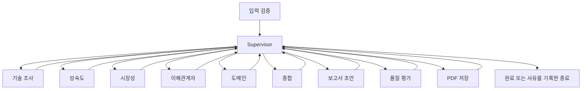

# KV Cache 최적화 기술 비교 평가 Agentic RAG

## Subject

본 프로젝트는 KV cache 최적화 기술인 **KIVI**와 **InfiniGen**을 선정하고, 공개 자료를 바탕으로 기술 성숙도·시장성·이해관계자·도메인 적합성을 비교 평가하는 Agentic RAG입니다. 기술의 우열을 단정하기보다 관점별 차이와 적용 조건, 근거의 한계를 정리합니다.

## Overview

- **Objective:** 두 기술을 복수 관점에서 비교 평가
- **Pattern:** Supervisor. 근거 공백과 미완료 관점을 보고 필요한 노드에 작업을 배정합니다.
- **동적 처리:** 고정 fan-out 대신 상태 기반 조건부 edge를 사용합니다. 하위 노드는 모두 Supervisor로 반환합니다.
- **Tools:** PDF RAG, FAISS, Tavily 웹 검색

## Selected Technologies

- **SW — KIVI:** KV cache 양자화로 GPU 메모리 사용량을 줄이는 접근
- **HW 메모리 활용 — InfiniGen:** KV 데이터를 CPU 호스트 메모리에 두고 필요한 데이터를 GPU로 가져오는 접근

InfiniGen은 새로운 하드웨어 자체보다 CPU·GPU 메모리 계층을 활용하는 기술로 분류했습니다.

## Features

- PDF 논문과 공개 웹 자료에서 기술 원리·성능·한계 근거 수집
- 기술 성숙도(TRL), 시장성, 이해관계자, 도메인 적합성 평가
- 근거 ID를 PDF 페이지 또는 웹 URL과 연결
- 기술·관점·항목을 지정한 부분 재조사와 기존 결과 병합
- 실행 오류와 근거 부족을 구분하고 호출 상한 안에서 재시도
- SQLite 체크포인트에서 같은 실행 ID로 중단 후 재개
- **확증 편향 방지:** 확인된 출처·추론·미확인 정보를 구분하고, 상충 관계와 미해결 근거 공백을 보고서에 기록
- 보고서 초안 → 구조 검사와 LLM Judge → 수정 → 통과한 PDF 저장
- 참고문헌 포함 10쪽 제한, 임시 파일 검증 후 최종 경로로 교체

## Tech Stack

- **Framework:** LangGraph, LangChain
- **LLM / Generator:** OpenAI 모델 (`LLM_MODEL` 환경변수로 지정)
- **LLM / Judge:** `JUDGE_MODEL`을 지정할 수 있으며, 생략하면 `LLM_MODEL` 사용
- **Persistence:** LangGraph `SqliteSaver`
- **Observability:** LangSmith 기본 추적과 로컬 결정 로그
- **Retrieval:** FAISS dense 벡터 검색
- **Embedding:** `BAAI/bge-m3`
- **Retrieval 평가:** InfiniGen 고정 질문 12개 기준 HitRate@5 **0.75(9/12)**, MRR@5 **0.576**

검색 지표는 관련 페이지를 찾는 성능이며, 생성된 평가의 사실 정확도를 의미하지 않습니다. KIVI 검색 평가는 아직 수행되지 않았습니다.

## Agents

- **Supervisor:** 완료 상태·근거 충분성·수정 지적에 따른 규칙 기반 라우팅. 선행 조건과 종료 가드는 코드로 검증

- **Technical Research:** KIVI·InfiniGen의 PDF와 웹 자료 검색, 근거 추출
- **Maturity:** 공개 근거를 바탕으로 기술 성숙도 평가
- **Market:** 시장 규모·채택 현황·생태계 평가
- **Stakeholders:** 이해관계자별 영향 평가
- **Domain:** GPU 기반 클라우드 LLM 서비스 적용 조건 평가
- **Synthesis:** 관점별 차이와 상충 관계 종합
- **Report:** 근거 ID가 보존된 보고서 초안 생성·수정
- **Quality:** Groundedness·중립성·편향 통제·네 관점 커버리지 검사
- **Export PDF:** 현재 버전의 품질 판정을 확인하고 PDF 저장

## State Schema

| 항목 | 구현 |
|---|---|
| 제어·결과 분리 | `SupervisorFields`와 기존 근거·평가 필드 분리. `new_state()`가 독립 초기값 생성 |
| 관측성 | 최신 판단 이유만 State에 유지. 전체 결정 기록은 JSONL·LangSmith |
| 지속성 비용 | 원문은 PDF·벡터 저장소에 유지. State에는 추출 근거와 최신 결과, 현재 주의사항 |
| 상관 | `trace_id`를 checkpoint의 `thread_id`와 LangSmith metadata에 연결 |
| 재개·복구 | SQLite checkpoint, `invoke(None)`으로 재개. 완료된 조사 재실행 방지 |
| 동시 처리 | 하위 노드 하나씩 실행. 중복 쓰기가 없어 누적 reducer 불필요 |
| 종료 보장 | 전체 30회, 노드별 6회, 보고서 추가 생성 2회가 기본 상한 |

`completed`는 최신 보고서의 품질 통과와 PDF 저장 확인을 뜻합니다. 근거·품질 미달은 `incomplete`, 복구 불가 오류는 `failed`로 종료합니다. 일부 미확인 항목은 한계로 남길 수 있지만 관점 전체의 근거가 없는 경우에는 보고서로 넘어가지 않습니다. `completed_agents`는 검토한 결과의 유효성을 표시하며 충분성 판단은 `evidence_decision`으로 별도 확인합니다.

## Architecture


```mermaid
flowchart TD
    START[입력 검증] --> S[Supervisor]
    S --> R[기술 조사]
    S --> M[성숙도]
    S --> K[시장성]
    S --> H[이해관계자]
    S --> D[도메인]
    R & M & K & H & D --> S
    S --> Y[종합]
    Y --> S
    S --> W[보고서 초안]
    W --> S
    S --> Q[품질 평가]
    Q --> S
    S --> P[PDF 저장]
    P --> S
    S --> E[완료 또는 사유를 기록한 종료]
```

Supervisor의 선택은 미완료·재검토 요청·호출 횟수·근거 공백에 따라 달라집니다. 같은 기술·관점의 추가 검색은 한 번 수행한 뒤 다시 평가하며, 진전 없는 전체 반복을 방지합니다. LLM은 조사·평가·작성·내용 Judge에 사용합니다.

## Directory Structure

```text
├── data/                         # PDF 원문·로컬 인덱스·조사 결과
├── src/kv_cache_eval/
│   ├── common/                   # 공유 State·스키마·설정
│   ├── features/
│   │   ├── supervisor/           # 라우팅·공통 실행 경계
│   │   ├── quality/              # 보고서 품질 평가
│   │   ├── technical_research/   # PDF RAG·웹 조사
│   │   ├── maturity/             # TRL 평가
│   │   ├── market/               # 시장성 평가
│   │   ├── stakeholders/         # 이해관계자 평가
│   │   ├── domain/               # 도메인 적합성 평가
│   │   ├── synthesis/            # 평가 종합
│   │   └── report/               # PDF 보고서
│   └── graph/                    # 전체 워크플로와 근거 확인
├── docs/                         # 공통 계약과 작업 기록
├── scripts/                      # 조사·Supervisor 실행과 재개 명령
├── tests/                        # 오프라인 테스트
├── main.py                       # 전체 그래프 실행
└── README.md
```

## Usage

Python 3.11과 `uv`가 필요합니다. `data/documents/`에 manifest에 맞는 원문 PDF 5개를 준비합니다. `.env.example`을 참고해 `.env`에 모델·API 키를 설정합니다. `.env`가 이미 있으면 보존합니다.

```bash
uv sync --locked --all-extras

# .env: LLM_PROVIDER=openai, LLM_MODEL, OPENAI_API_KEY, TAVILY_API_KEY
# LangSmith 사용 시 LANGSMITH_TRACING=true, LANGSMITH_API_KEY, LANGSMITH_PROJECT
.venv/bin/python main.py

# 실행 ID를 지정하는 방법
.venv/bin/python scripts/run_supervisor.py --run-id example-01

# 기술 조사 뒤 의도적으로 중단하여 재개 동작 확인
.venv/bin/python scripts/run_supervisor.py --run-id resume-01 --pause-after technical_research
.venv/bin/python scripts/run_supervisor.py --run-id resume-01 --resume
```

`main.py`의 `QUESTION` 또는 CLI의 `--question`으로 질문을 지정합니다. 같은 ID의 실행을 덮어쓰지 않습니다. 재개할 때는 저장된 질문과 호출 예산을 사용합니다.

- 체크포인트: `data/cache/supervisor/checkpoints.sqlite`
- 실행별 기록: `data/cache/supervisor/<run-id>/decisions.jsonl`, `state.json`, `graph.mmd`
- 최종 PDF: `output/pdf/kv_cache_evaluation_report.pdf` (`REPORT_PDF_PATH`로 변경 가능)
- 기본 한글 폰트: 저장소의 `assets/fonts/NanumGothic.ttf` (`REPORT_FONT_PATH`로 변경 가능)

체크포인트와 실행 기록에는 근거·평가 내용이 포함되며 Git에서 제외됩니다. 생성 도중 중단된 외부 요청은 재개 시 다시 호출될 수 있습니다. 동일 실행의 PDF는 임시 파일 교체로 저장합니다.

### `.env`를 바꿔도 인증 오류가 남는 경우

이 프로젝트는 이미 설정된 프로세스 환경변수를 `.env`보다 우선한다. 실행 환경의 키가 오래된 값이면 `.env` 수정만으로 적용되지 않는다. 로컬 파일의 OpenAI 키를 사용하려면 해당 실행에서만 기존 값을 제외한다.

```bash
env -u OPENAI_API_KEY .venv/bin/python scripts/run_supervisor.py --run-id new-run-01
```

API 키 원문을 로그나 커밋에 남기지 않는다. LangSmith의 추적 업로드 오류와 OpenAI 모델 호출 오류는 별도로 확인한다.

## Verification

```bash
# .env가 있어도 외부 통신을 차단하는 오프라인 검증
PYTHONPATH=tests/offline_guard:src HF_HUB_OFFLINE=1 LANGSMITH_TRACING=false \
  .venv/bin/python -m unittest discover -s tests -v
```

오프라인 테스트는 선택적 재작업, 오류·종료, 품질 미달 후 수정, 실제 PDF 렌더링, SQLite 재개를 검증합니다. 대역 응답으로 통과한 테스트는 실제 모델의 보고서 품질이나 실제 서비스 운영 증거를 의미하지 않습니다. 실행 결과와 남은 제한은 [작업 기록](docs/main-ver2-worklog.md)에 구분해 기록합니다.

개발 계약은 [공통 개발 계약](docs/supervisor-common-contract.md)을 참고하세요.

## Contributors

아래는 기존 기능 구현의 기여 기록입니다.

- **배민혁** : InfiniGen 기술 조사 RAG·웹 검색, 공통 조사 흐름 및 전체 그래프 통합
- **조수연** : KIVI RAG·근거 추출, 기술 성숙도(TRL) 평가
- **정태호** : 시장성 웹 조사, 평가 기준 및 시장성 평가 노드
- **김예진** : 이해관계자 평가 노드
- **안민아** : 도메인 적합성 평가와 수치 근거 검증
- **김지환** : 관점별 결과 종합 및 PDF 보고서 생성
